# Scriptum Automated Test Report

- Base URL: `http://localhost:8765`
- Total: **29**  ·  Passed: **29**  ·  Warnings: **0**  ·  Failed: **0**
- Book under test: `the-intelligent-investor` (46 chapters, silent placeholder audio generated to match timing.json)

## Summary

| # | Test | Status | Duration | Details |
|---|------|--------|----------|---------|
| 1 | Library: loads with book cards | ✅ pass | 665 ms | title='Scriptum', book cards=1 |
| 2 | Library: counts | ✅ pass | 10 ms | converted=1, uploaded=1 |
| 3 | Library: theme light | ✅ pass | 700 ms | dark bg=rgb(18, 18, 24) → light bg=rgb(248, 249, 252) (--bg-primary=#f8f9fc) |
| 4 | Library: theme sepia | ✅ pass | 396 ms | sepia bg=rgb(244, 236, 216), restored dark |
| 5 | Library: search filter | ✅ pass | 496 ms | results for 'Intelligent': 1 |
| 6 | Library: list/grid layout toggle | ✅ pass | 96 ms | list/grid toggle ok |
| 7 | Library: notes section navigation | ✅ pass | 152 ms | notes section title='Highlights & Notes' |
| 8 | Reader: loads with text rendered | ✅ pass | 988 ms | title='The Intelligent Investor', sentences=37, chapters=46 |
| 9 | Reader: audio metadata loaded | ✅ pass | 9 ms | src=..ligent_Investor/audio/ch01.mp3, duration=263.7s, readyState=4 |
| 10 | Reader: play/pause toggles state | ✅ pass | 310 ms | playing reached t=0.06s, paused=True |
| 11 | Reader: audio→text sync via timeupdate | ✅ pass | 37 ms | 3/3 sync checks passed — t=1.72s→ch00_s0000; t=8.81s→ch00_s0002; t=17.86s→ch00_s0004 |
| 12 | Reader: click sentence seeks audio | ✅ pass | 59 ms | clicked ch00_s0002 → audio t=6.19s (expected ~6.19s) |
| 13 | Reader: skip +30 / −10 | ✅ pass | 605 ms | base=60s, +30→90.0s, −10→80.0s |
| 14 | Reader: speed control | ✅ pass | 130 ms | rate=1.5 → 1.5, label='1.5x', restored 1x |
| 15 | Reader: chapter navigation | ✅ pass | 64 ms | chapter 0 → 1 → 0 ok |
| 16 | Reader: highlight via button | ✅ pass | 94 ms | highlighted ch00_s0001, total highlights=1 |
| 17 | Reader: note via button + modal | ✅ pass | 282 ms | notes=1, .has-note applied=True |
| 18 | Reader: bookmark create + panel list | ✅ pass | 783 ms | bookmarks stored=1, UI items=1 |
| 19 | Reader: in-book search | ✅ pass | 662 ms | 'investor' → 0 results |
| 20 | Reader: sleep timer | ✅ pass | 402 ms | timer set=True, display='' |
| 21 | Reader: font size increase | ✅ pass | 622 ms | font 18px → 22px |
| 22 | Reader: theme switching | ✅ pass | 670 ms | dark bg=rgb(18, 18, 24) → light bg=rgb(244, 245, 248) |
| 23 | Reader: progress persists across reload | ✅ pass | 1676 ms | reloaded, resumed at t=45.5s |
| 24 | Reader: highlights persist across reload | ✅ pass | 7 ms | stored=1, DOM highlighted=1 |
| 25 | Reader Text: shell loads | ✅ pass | 583 ms | reader-text title='The Intelligent Investor' |
| 26 | Service worker registered | ✅ pass | 576 ms | SW controller: http://localhost:8765/web/sw.js |
| 27 | Mobile viewport renders | ✅ pass | 1910 ms | 390×844 library + reader ok |
| 28 | Performance metrics | ✅ pass | 51 ms | DCL=40ms, load=40ms, TTFB=10ms |
| 29 | Offline static cache | ✅ pass | 649 ms | offline reload ok, title='Scriptum' |

## Test Details

### 1. ✅ Library: loads with book cards
- Status: **pass**
- Duration: 665 ms
- Details: title='Scriptum', book cards=1
- Screenshot: `screenshots/library_loads_with_book_cards.png`

### 2. ✅ Library: counts
- Status: **pass**
- Duration: 10 ms
- Details: converted=1, uploaded=1
- Screenshot: `screenshots/library_counts.png`

### 3. ✅ Library: theme light
- Status: **pass**
- Duration: 700 ms
- Details: dark bg=rgb(18, 18, 24) → light bg=rgb(248, 249, 252) (--bg-primary=#f8f9fc)
- Screenshot: `screenshots/library_theme_light.png`

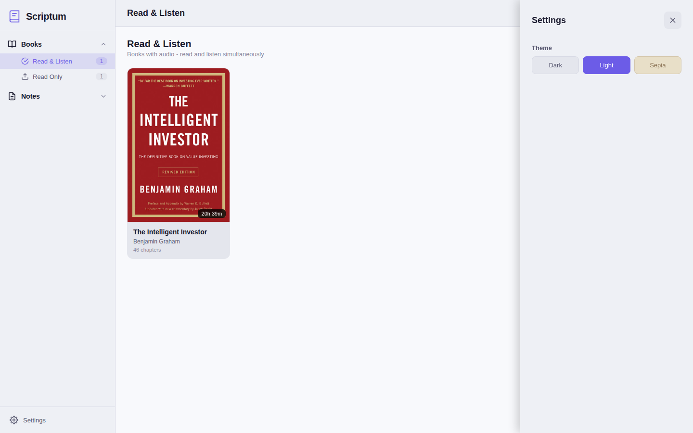

### 4. ✅ Library: theme sepia
- Status: **pass**
- Duration: 396 ms
- Details: sepia bg=rgb(244, 236, 216), restored dark
- Screenshot: `screenshots/library_theme_sepia.png`

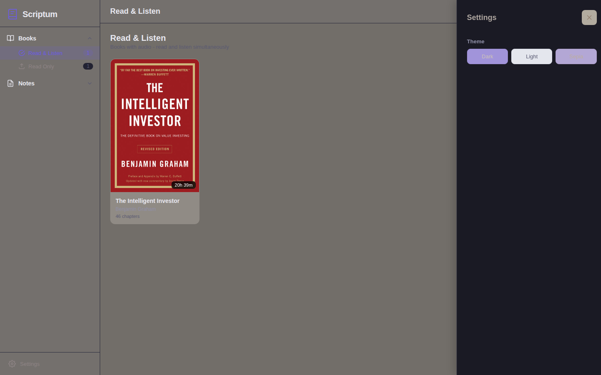

### 5. ✅ Library: search filter
- Status: **pass**
- Duration: 496 ms
- Details: results for 'Intelligent': 1
- Screenshot: `screenshots/library_search_filter.png`

### 6. ✅ Library: list/grid layout toggle
- Status: **pass**
- Duration: 96 ms
- Details: list/grid toggle ok
- Screenshot: `screenshots/library_list_grid_layout_toggle.png`

### 7. ✅ Library: notes section navigation
- Status: **pass**
- Duration: 152 ms
- Details: notes section title='Highlights & Notes'
- Screenshot: `screenshots/library_notes_section_navigation.png`

### 8. ✅ Reader: loads with text rendered
- Status: **pass**
- Duration: 988 ms
- Details: title='The Intelligent Investor', sentences=37, chapters=46
- Screenshot: `screenshots/reader_loads_with_text_rendered.png`

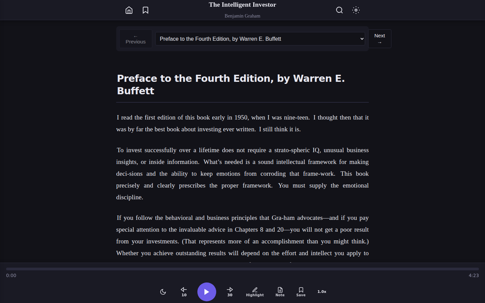

### 9. ✅ Reader: audio metadata loaded
- Status: **pass**
- Duration: 9 ms
- Details: src=..ligent_Investor/audio/ch01.mp3, duration=263.7s, readyState=4
- Screenshot: `screenshots/reader_audio_metadata_loaded.png`

### 10. ✅ Reader: play/pause toggles state
- Status: **pass**
- Duration: 310 ms
- Details: playing reached t=0.06s, paused=True
- Screenshot: `screenshots/reader_play_pause_toggles_state.png`

### 11. ✅ Reader: audio→text sync via timeupdate
- Status: **pass**
- Duration: 37 ms
- Details: 3/3 sync checks passed — t=1.72s→ch00_s0000; t=8.81s→ch00_s0002; t=17.86s→ch00_s0004
- Screenshot: `screenshots/reader_audio_text_sync_via_timeupdate.png`

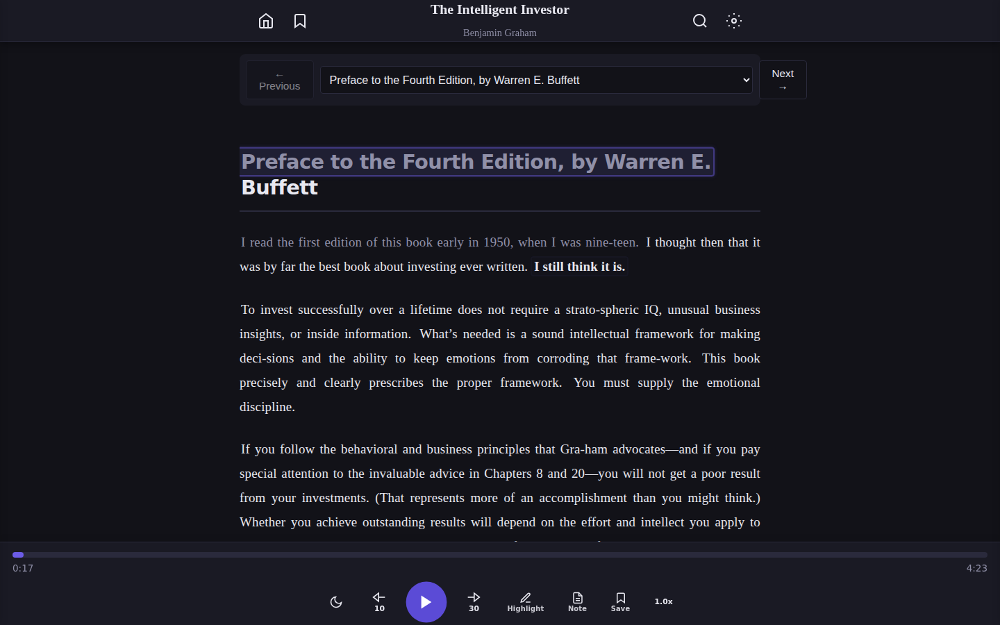

### 12. ✅ Reader: click sentence seeks audio
- Status: **pass**
- Duration: 59 ms
- Details: clicked ch00_s0002 → audio t=6.19s (expected ~6.19s)
- Screenshot: `screenshots/reader_click_sentence_seeks_audio.png`

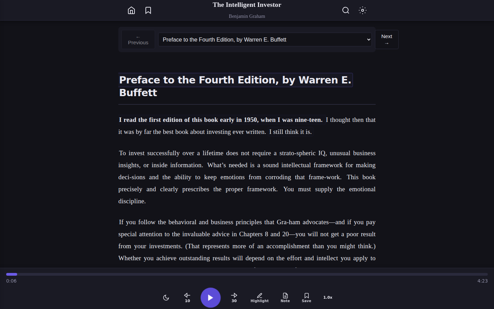

### 13. ✅ Reader: skip +30 / −10
- Status: **pass**
- Duration: 605 ms
- Details: base=60s, +30→90.0s, −10→80.0s
- Screenshot: `screenshots/reader_skip_30_10.png`

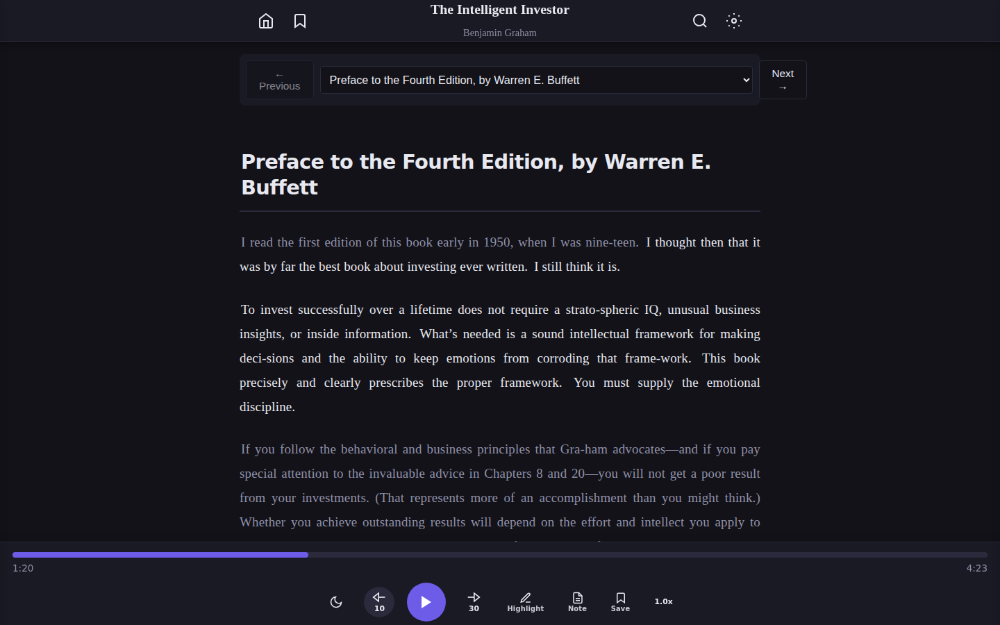

### 14. ✅ Reader: speed control
- Status: **pass**
- Duration: 130 ms
- Details: rate=1.5 → 1.5, label='1.5x', restored 1x
- Screenshot: `screenshots/reader_speed_control.png`

### 15. ✅ Reader: chapter navigation
- Status: **pass**
- Duration: 64 ms
- Details: chapter 0 → 1 → 0 ok
- Screenshot: `screenshots/reader_chapter_navigation.png`

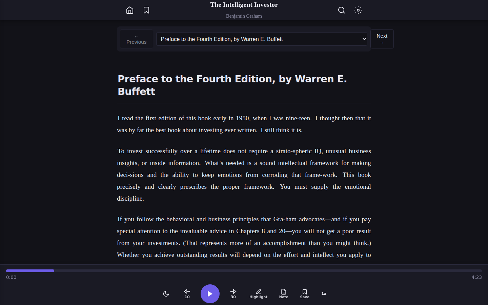

### 16. ✅ Reader: highlight via button
- Status: **pass**
- Duration: 94 ms
- Details: highlighted ch00_s0001, total highlights=1
- Screenshot: `screenshots/reader_highlight_via_button.png`

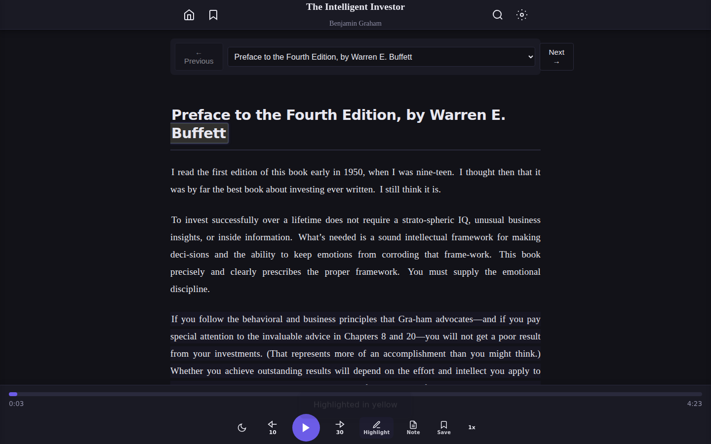

### 17. ✅ Reader: note via button + modal
- Status: **pass**
- Duration: 282 ms
- Details: notes=1, .has-note applied=True
- Screenshot: `screenshots/reader_note_via_button_modal.png`

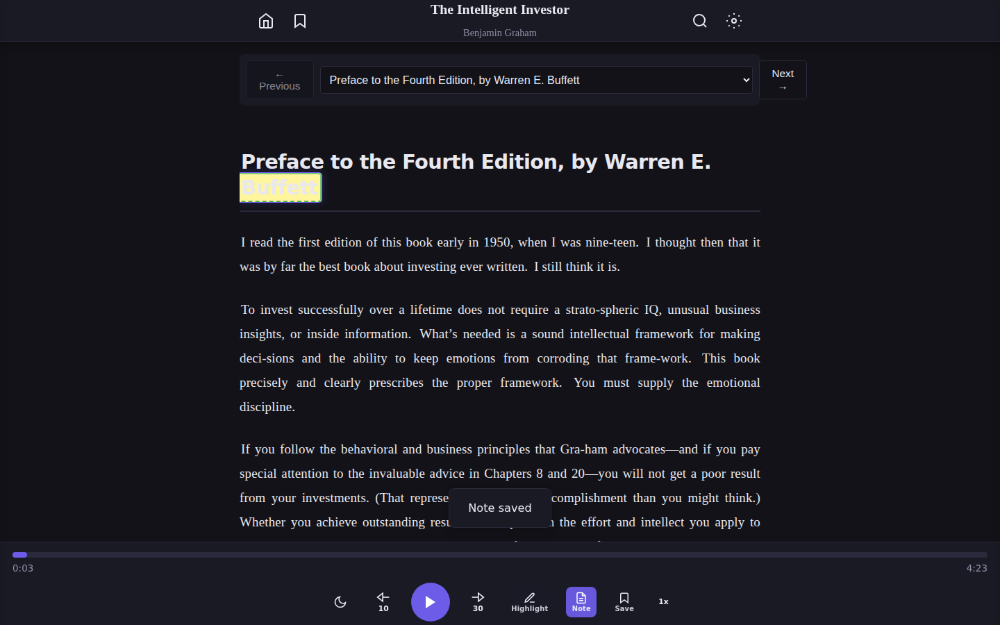

### 18. ✅ Reader: bookmark create + panel list
- Status: **pass**
- Duration: 783 ms
- Details: bookmarks stored=1, UI items=1
- Screenshot: `screenshots/reader_bookmark_create_panel_list.png`

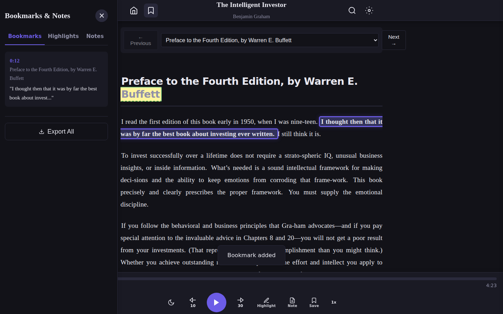

### 19. ✅ Reader: in-book search
- Status: **pass**
- Duration: 662 ms
- Details: 'investor' → 0 results
- Screenshot: `screenshots/reader_in_book_search.png`

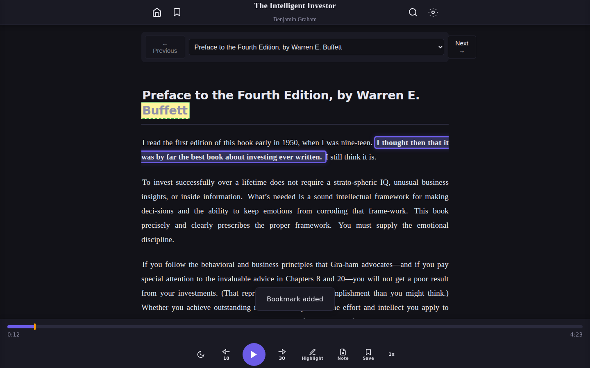

### 20. ✅ Reader: sleep timer
- Status: **pass**
- Duration: 402 ms
- Details: timer set=True, display=''
- Screenshot: `screenshots/reader_sleep_timer.png`

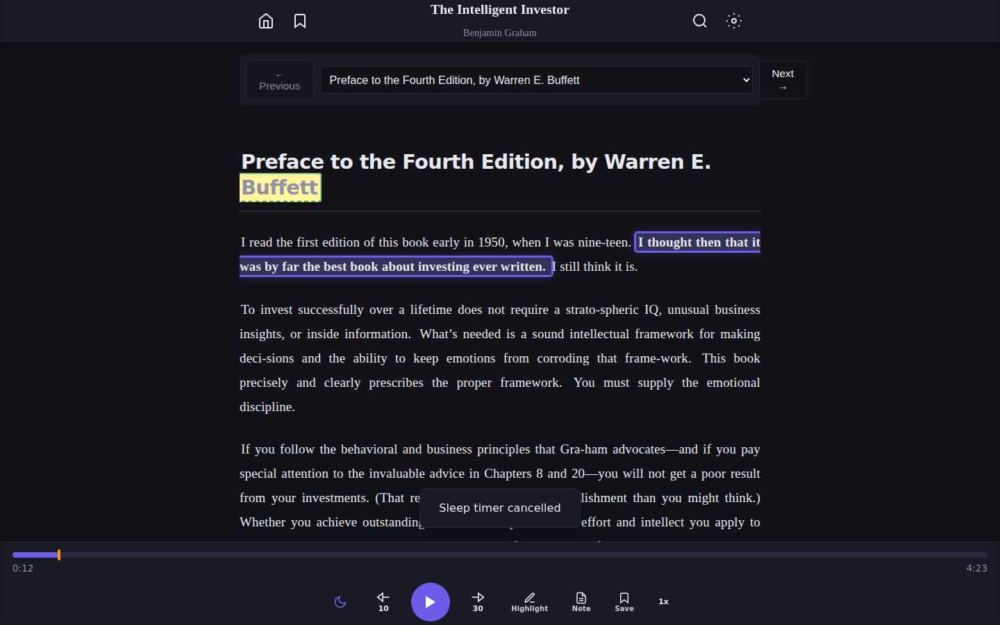

### 21. ✅ Reader: font size increase
- Status: **pass**
- Duration: 622 ms
- Details: font 18px → 22px
- Screenshot: `screenshots/reader_font_size_increase.png`

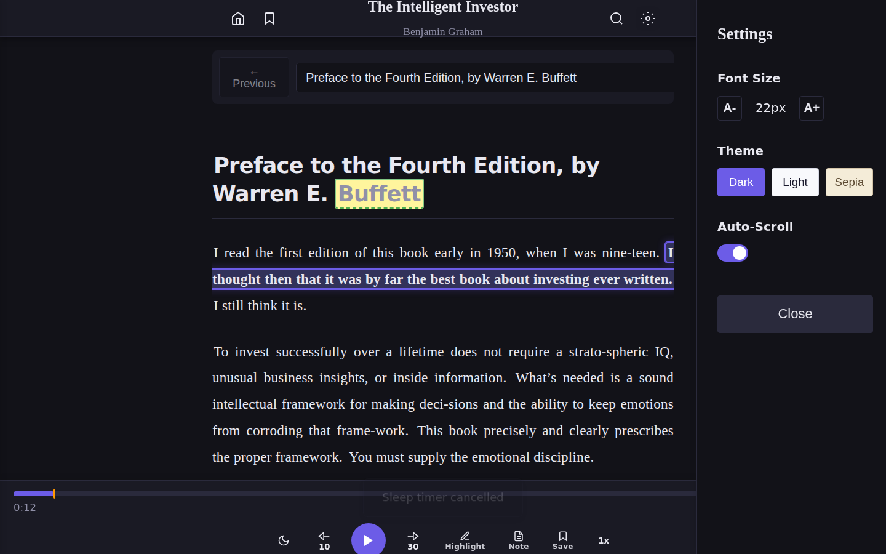

### 22. ✅ Reader: theme switching
- Status: **pass**
- Duration: 670 ms
- Details: dark bg=rgb(18, 18, 24) → light bg=rgb(244, 245, 248)
- Screenshot: `screenshots/reader_theme_switching.png`

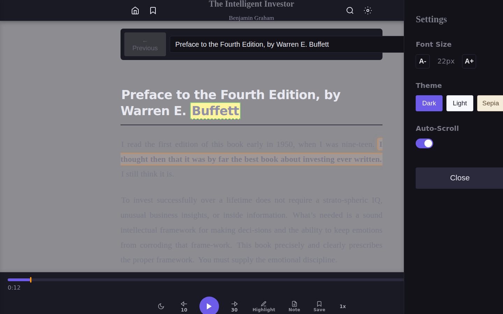

### 23. ✅ Reader: progress persists across reload
- Status: **pass**
- Duration: 1676 ms
- Details: reloaded, resumed at t=45.5s
- Screenshot: `screenshots/reader_progress_persists_across_reload.png`

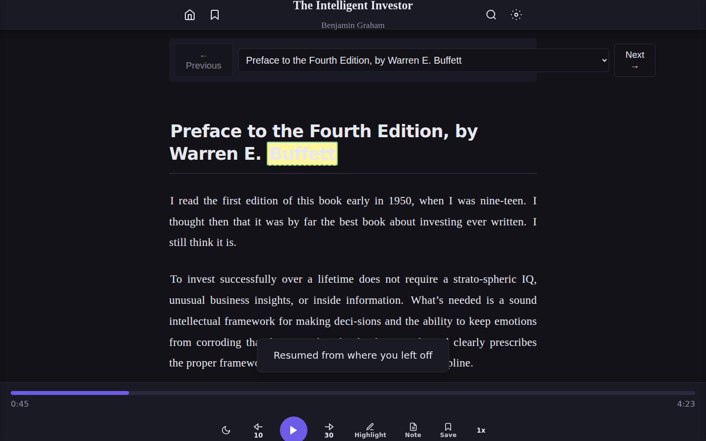

### 24. ✅ Reader: highlights persist across reload
- Status: **pass**
- Duration: 7 ms
- Details: stored=1, DOM highlighted=1
- Screenshot: `screenshots/reader_highlights_persist_across_reload.png`

### 25. ✅ Reader Text: shell loads
- Status: **pass**
- Duration: 583 ms
- Details: reader-text title='The Intelligent Investor'
- Screenshot: `screenshots/reader_text_shell_loads.png`

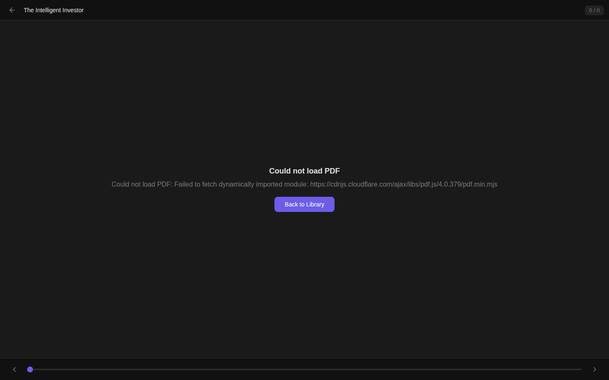

### 26. ✅ Service worker registered
- Status: **pass**
- Duration: 576 ms
- Details: SW controller: http://localhost:8765/web/sw.js
- Screenshot: `screenshots/service_worker_registered.png`

### 27. ✅ Mobile viewport renders
- Status: **pass**
- Duration: 1910 ms
- Details: 390×844 library + reader ok
- Screenshot: `screenshots/mobile_viewport_renders.png`

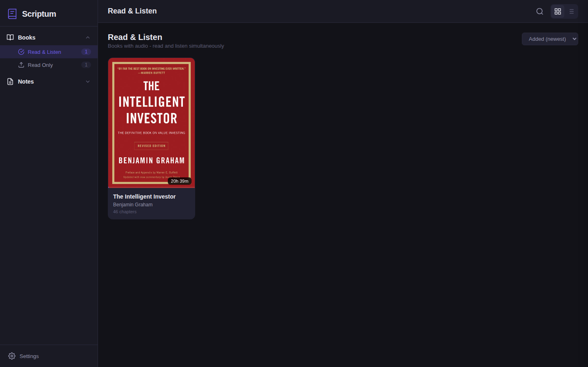

### 28. ✅ Performance metrics
- Status: **pass**
- Duration: 51 ms
- Details: DCL=40ms, load=40ms, TTFB=10ms
- Screenshot: `screenshots/performance_metrics.png`

### 29. ✅ Offline static cache
- Status: **pass**
- Duration: 649 ms
- Details: offline reload ok, title='Scriptum'
- Screenshot: `screenshots/offline_static_cache.png`

